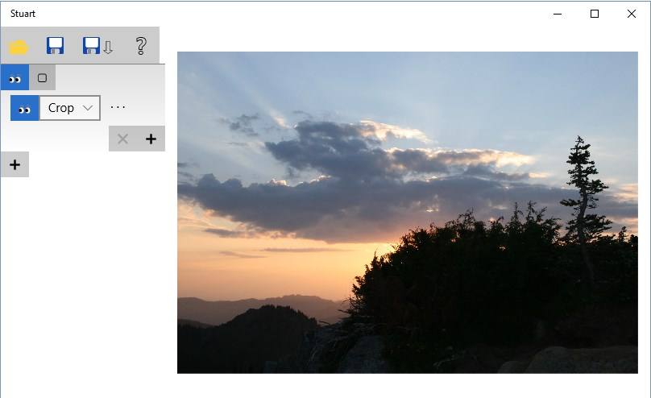
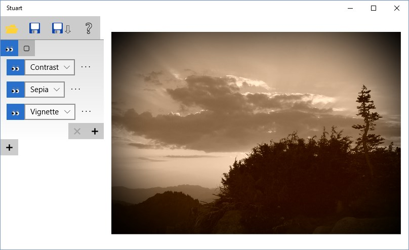
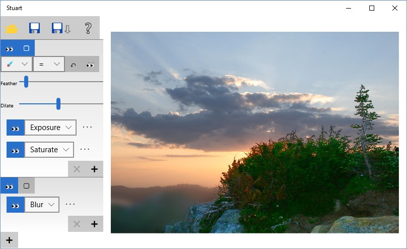
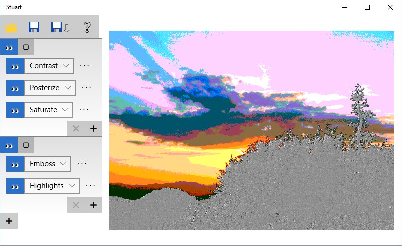

## Shawn's Terrific Universal App for photogRaph Tweaking

This is a simple, powerful, and contrivedly acronymed Windows 10 photo editing app,
created during an app building exercise to test the [Win2D](http:/github.com/microsoft/win2d) graphics API.

#### Where to get it

- [Download from the Store](https://www.microsoft.com/store/apps/9NBLGGH1XSQK) (_coming soon - just waiting for the publish to go through)_
- Or clone the source from github and load Stuart.sln into Visual Studio 2015

#### Features

- Use a rich set of image effects to tweak your photos
- Apply effects to the whole image or just selected parts of it
- Feather selected regions for smooth transitions
- Runs on Windows 10 PCs and phones

#### Supported effects

- Framing:
    - Crop
    - Straighten
- Color adjustment:
    - Exposure
    - Highlights & Shadows
    - Temperature & Tint
    - Contrast
    - Saturate
- Stylize:
    - Grayscale
    - Sepia
    - Vignette
- Special effects:
    - Blur
    - Motion blur
    - Sharpen
    - Edge detection
    - Emboss
    - Invert
    - Posterize

#### How to use it

Start by loading a photo:

At the top of the UI are the open, save, save-as and help buttons. Below this is a list of edit groups,
each of which contains a list of effects. To start off, there is just one edit group, containing a single
Crop effect.

To view different parts of the image, use pinch zoom or the A and Z keys.

Click the '+' buttons to add new effects or edit groups. Drag things to reorder them, and use the 'x'
button to delete the selected effect. The pair-of-eyes icons are used to show or hide effects and edit
groups - this is handy for doing quick before/after comparisons.

To adjust the settings of an effect, click the '...' to the right of the effect name, which brings
up a set of sliders. Here is our photo after Highlights, Temperature, and Saturate adjustment:

For a retro look, try Sepia and Vignette, with some Contrast thrown in for good measure:

Sometimes you want to adjust only part of a photo without affecting other areas. To do this, click
the square icon at the top of an edit group. This brings up region editing options for that group.
All the effects inside the group will apply only to the selected region.

The region editing options are:
- Selection mode (rectangle, ellipse, freehand, or magic wand)
- Selection operation (replace region, add to region, subtract from region, or invert region)
- Undo region edit
- Show region (another pair-of-eyes icon - if enabled, the region border is displayed in pink while everything outside the region is grayed out)
- Feather - softens the edge of the region, so its effects will smoothly crossfade with the outside unaffected part of the photo
- Dilate - expands or shrinks the selected region (useful for cleaning up magic wand selections)

Magic wand mode selects areas of the photo that have similar colors. To use it,
click and drag on the photo. The initial click point defines what color to select,
and how far you drag controls the color matching tolerance.

While in region editing mode, clicking on the photo will change the selected region
rather than panning or zooming the view. If you want to pan or zoom again, click the
square 'edit region' button a second time to turn off region edit mode.

Here is our photo using a region to apply Exposure and Saturation effects only to
the foreground trees and rocks, brightening them up without changing the sky. It uses
a second edit group to blur the distant hills only in the bottom left of the photo:

And finally, something rather more extreme: this screenshot uses two edit groups to apply
different effects to the sky vs. ground:

#### TODO

- Magic wand drag should be DPI aware
- Support app suspend/resume
